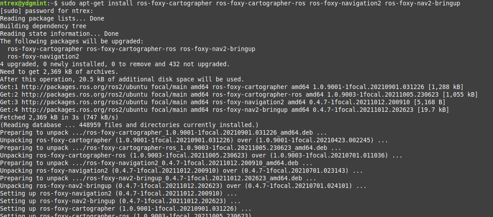

# ROS 2 - 원격 PC 설정

* [ ] 원격 PC에서 Ubuntu 설치하기 &#x20;

<!---->

* STELLA N1은 Ubuntu 20.04 LTS 버전을 기준으로 제작되었습니다. STELLA N1을 조정할 원격 컴퓨터에서 Ubuntu  20.04 LTS 버전 설치를 권장 드립니다. Ubuntu 설치는 하기의 링크를 참고하여 설치합니다.



[https://ubuntu.com/tutorials/install-ubuntu-desktop](https://ubuntu.com/tutorials/install-ubuntu-desktop)



[https://linuxhint.com/install\_ubuntu\_desktop\_2004/](https://linuxhint.com/install\_ubuntu\_desktop\_2004/)



* [ ] Ubuntu가 설치된 원격 PC에 ROS 2설치하기

<!---->

* STELLA N1은 ROS(Robot Operating System)을 기반으로 구성된 자율주행 연구용 플랫폼입니다. 원격 PC에 ROS 2 설치 후 STELLA N1 운용이 가능합니다. ROS 2 설치는 하기의 명령어를 이용하여 설치합니다.&#x20;

```
wget https://raw.githubusercontent.com/ntrexlab/ROS_INSTALL_SCRIPT/main/install_ros2_foxy.sh && chmod 755 ./install_ros2_foxy.sh && bash ./install_ros2_foxy.sh
```

* [ ] Ubuntu가 설치된 원격 PC에 패키지 설치하기&#x20;

<!---->

* Ubuntu 터미널에 apt-get install 명령어를 사용하여 패키지를 설치합니다.

```
sudo apt-get install ros-foxy-cartographer ros-foxy-cartographer-ros ros-foxy-navigation2 ros-foxy-nav2-bringup
```



* [ ] Ubuntu가 설치된 원격 PC에 라이브러리 설치하기&#x20;

```
cd ~/colcon_ws/src/
git clone https://github.com/ntrexlab/STELLA_REMOTE_PC_ROS2.git
cd ~/colcon_ws/src/STELLA_REMOTE_PC_ROS2/stella_teleop/stella_teleop/script
chmod +x teleop_keyboard.py
cd ~/colcon_ws
colcon build --symlink-install
```
