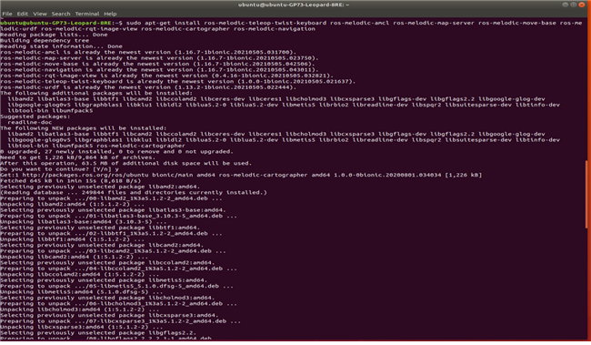
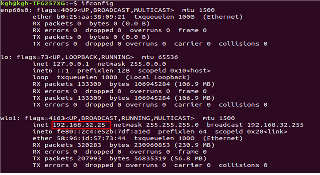
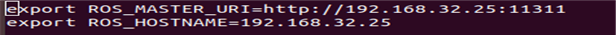

# ROS 2 - 원격 PC 설정

* [ ] 원격 PC에서 Ubuntu 설치하기  
* STELLA N1은 Ubuntu 20.04 LTS 버전을 기준으로 제작되었습니다. STELLA N1을 조정할 원격 컴퓨터에서 Ubuntu  20.04 LTS 버전 설치를 권장 드립니다. Ubuntu 설치는 하기의 링크를 참고하여 설치합니다.



[https://ubuntu.com/tutorials/install-ubuntu-desktop](https://ubuntu.com/tutorials/install-ubuntu-desktop)



[https://linuxhint.com/rufus\_bootable\_usb\_install\_ubuntu\_18-04\_lts/](https://linuxhint.com/rufus_bootable_usb_install_ubuntu_18-04_lts/)



* [ ] Ubuntu가 설치된 원격 PC에 ROS 2설치하기
* STELLA N1은 ROS\(Robot Operating System\)을 기반으로 구성된 자율주행 연구용 플랫폼입 니다. 원격 컴퓨터에 ROS 2 설치 후 STELLA N1 운용이 가능합니다. ROS 2 설치는 하기의 명령어를 이용하여 설치합니다. 

```text
wget https://raw.githubusercontent.com/ntrexlab/ROS_INSTALL_SCRIPT/main/install_ros2_foxy.sh&& chmod 755 ./install_ros2_foxy.sh && bash ./install_ros2_foxy.sh
```

* 위 명령어를 이용하지 않고 직접 ROS 2를 설치할 경우, 하기의 링크를 참고하여 설치하여 주십시오.



[http://docs.ros.org/en/rolling/Installation/Ubuntu-Install-Binary.html](http://docs.ros.org/en/rolling/Installation/Ubuntu-Install-Binary.html)



* [ ] ROS 2 설치 확인하기 
* 바탕화면에서 Ctrl + Alt + t를 눌러 Terminal에서 roscore 입력합니다.
* roscore 입력 시 하기의 그림과 같이 동작되면 정상적으로 작동함을 확인할 수 있습니다.


* [ ] STELLA N1  필수 ROS Package 설치하기
* Ubuntu 터미널에 apt-get install 명령어를 사용하여 패키지를 설치합니다.

```text
$ sudo apt-get install ros-melodic-teleop-twist-keyboard ros-melodic-amcl ros-melodic-map-server ros-melodic-move-base ros-melodic-urdf ros-melodic-xacro ros-melodic-rqt-image-view ros-melodic-navigation ros-melodic-cartographer*
```



* [ ] STELLA N1 라이브러리 설치하기
* 우선, STELLA 라이브러리 설치를 위해 ROS Workspace 폴더를 생성합니다.



[http://wiki.ros.org/catkin/Tutorials/create\_a\_workspace](http://wiki.ros.org/catkin/Tutorials/create_a_workspace)



* 일반적으로 사용하는 Workspace 이름인 catkin\_ws를 기준으로, catkin\_ws에 진입하여 git clone을 통해 Stella 라이브러리 다운로드 합니다.

```text
cd ~/catkin_ws/src/
git clone https://github.com/ntrexlab/STELLA_REMOTE_PC.git
```

* 다운로드 된 라이브러리는 catkin\_make를 통해 컴파일 합니다.

```text
cd ~/catkin_ws/src/STELLA_REMOTE_PC/stella_teleop/src/
chmod +x stella_teleop_key.py
cd ~/catkin_ws
catkin_make
```


* [ ] 네트워크 설정하기


* 터미널 프롬프터에 ifconfig를 아래와 같이 입력하여 원격 컴퓨터의 네트워크 IP 주소를 확인합니다.

```text
ifconfig
```



* IP 주소 확인 후, ~/.bashrc 파일을 수정하여 아래와 같이 ROS\_MASTER와 ROS\_HOSTNAME을 확인한 원격 PC의 IP로 설정합니다.

```text
sudo gedit ~/.bashrc #마지막 줄에 아래 코드 추가
 export ROS_MASTER_URI=http://[원격 PC의 ip주소]:11311 
 export ROS_HOSTNAME=[원격 PC의 ip주소]
```



* [ ] 설정 업데이트
* 상기와 같이 설정하신 후 아래의 명령어를 터미널 프롬프터에 입력하여 변경된 부분들을 컴퓨터에 업데이트 합니다.

```text
source ~/.bashrc
cd catkin_ws
source devel/setup.bash
```


