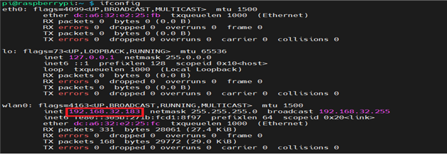
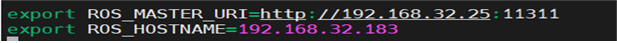

# ROS 1 - Raspberry Pi(Single Board Computer) 설정

* [ ] single Board Computer 모델 확인하기

<!---->

* STELLA N1 – Raspberry Pi 버전에는 Raspberry Pi 4 Model B(SBC)가 기본적으로 구성되어 있습니다. 해당 SBC도 원격 PC와 동일하게 ROS 및 STELLA 라이브러리 설정이 필요합니다.
* STELLA N1 구매 시, 제공하는 Raspberry Pi를 사용하실 경우 기본적으로 하기와 같은 과정이 전부 작업된 <mark style="color:red;">**Raspberry Pi OS가 탑재된SD카드가 제공됩니다.**</mark>
* SD카드를 삽입하여 사용하시면 됩니다. &#x20;
* OS 재 설치가 필요하신 경우 하기의 링크에서 IMG 파일을 재 설치 합니다.



[http://gofile.me/4Z3Cs/vQvsuL7mL](http://gofile.me/4Z3Cs/vQvsuL7mL)



* 기본 탑재된 Raspberry Pi OS의 초기 비밀번호는 1 입니다.
*   저희가 제공하는 IMG 파일이 아닌 사용자께서 직접 설치를 하실 경우 하기의 과정을

    &#x20;참고하여 설치합니다.


* [ ] Raspberry Pi OS 설치

<!---->

* STELLA 내 Raspberry Pi에 Raspberry Pi OS를 설치합니다. 설치 방법은 하기의 링크를 참고하여 설치합니다.



[https://www.raspberrypi.org/documentation/computers/getting-started.html](https://www.raspberrypi.org/documentation/computers/getting-started.html)



* Raspberry Pi OS 설치 후 하기의 명령어를 통해 최신 버전으로 업데이트합니다.

```
sudo apt-get update && sudo apt-get upgrade
```

* [ ] Raspberry Pi OS 내 ROS 설치

<!---->

* 다음 명령어를 이용하여 Raspberry Pi OS 내 ROS를 설치합니다. 다음 방법을 이용할 경우 STELLA N1 라이브러리 설치부터  이어서 진행합니다.

```
wget https://raw.githubusercontent.com/ntrexlab/ROS_INSTALL_SCRIPT/main/install_ros_melodic_rp4.sh && chmod 755 ./install_ros_melodic_rp4.sh && bash ./install_ros_melodic_rp4.sh
```

* 위 명령어를 이용하지 않고 직접 Raspberry Pi OS 내 ROS를 설치하실 경우, 하기의 링크를 참고하여 설치합니다.



[http://wiki.ros.org/ROSberryPi/Installing%20ROS%20Melodic%20on%20the%20Raspberry%20Pi](http://wiki.ros.org/ROSberryPi/Installing%20ROS%20Melodic%20on%20the%20Raspberry%20Pi)



* [ ] STELLA N1 패키지 설치

<!---->

* STELLA N1 관련 패키지를 설치합니다.

```
cd ~/ros_catkin_ws
rosinstall_generator tf nav_msgs --rosdistro melodic --deps --wet-only --tar > melodic-custo m_ros.rosinstall
wstool merge -t src melodic-custom_ros.rosinstall
wstool update -t src
rosdep install --from-paths src --ignore-src --rosdistro melodic -y -r --os=debian:buster
sudo ./src/catkin/bin/catkin_make_isolated --install -DCMAKE_BUILD_TYPE=Release — install-s pace /opt/ros/melodic
```

* [ ] STELLA N1 라이브러리 설치

<!---->

* ROS workspace 사이트 참조하여 만듭니다.



[ttp://wiki.ros.org/melodic/installation/Ubuntu](http://wiki.ros.org/melodic/installation/Ubuntu)



* &#x20;STELLA N1 라이브러리 다운로드 합니다.

```
cd ~/catkin_ws/src/
git clone https://github.com/ntrexlab/STELLA_RASPBERRYPI.git
cd ~/catkin_ws/src/STELLA_RASPBERRYPI/stella_teleop_bluetooth/src/
chmod +x stella_teleop_bluetooth.py
```

* [ ] 패키지 컴파일

<!---->

* 패키지 컴파일을 진행합니다.

```
cd ~/catkin_ws/
catkin_make
```

* [ ] Serial 통신 설치

<!---->

* 센서 데이터 수집 및 모터드라이버 Command 입출력을 위한 Serial 통신 설정합니다.
* 하기의 명령어를 입력하여 USB 포트 설정합니다.

```
cd ~/catkin_ws/src/STELLA_RASPBERRYPI/stella_bringup
sh create_udev_rules.sh
ls -la /dev/ 
```

* Device 목록에 YDLIDAR, AHRS, MW, BT 항목이 생성됨을 확인합니다.


* [ ] Raspberry Pi 네트워크 설정하기

.png>)

* 터미널 프롬프터에 ifconfig를 입력하여 Raspberry Pi의 네트워크 IP 주소를 확인합니다.



* IP 주소 확인 후, \~/.bashrc 파일을 수정하여 아래와 같이 ROS\_MASTER와 ROS\_HOSTNAME을 확인된 Raspberry Pi의 IP로 설정합니다.

```
sudo nano ~/.bashrc  # 마지막 줄에 아래 코드 추가
  export ROS_MASTER_URI=http://[원격 PC의 ip주소]:11311
  export ROS_HOSTNAME=[Raspberry Pi의 ip주소]
```



* source 명령어를 터미널에 입력하여 \~/.bashrc 파일 업데이트합니다.

```
source ~/.bashrc
```

* [ ] Raspberry Pi SD카드 설정

<!---->

* Raspberry Pi 내 장착되어 있는 SD카드 메모리를 전부 활용할 수 있도록 다음의 과정을 진행합니다.

```
sudo raspi-config
    -> 6 Advanced Options를 선택
    -> A1 Expand Filesystem을 선택
```

* [ ] NTP(Network Time Protocol) 서버를 이용한 시간 설정

```
sudo apt-get install ntpdate
sudo ntpdate ntp.ubuntu.com
```

* [ ] SSH를 이용하여 원격 접속 확인

<!---->

* Raspberry Pi에 원격으로 접속할 수 있도록 다음의 과정을 진행합니다.

```
sudo raspi-config
    -> 3  Interface Options를 선택
    -> P2 SSH를 선택하여 SSH를 Enable함
```

* 추가적으로, 비밀번호 재 설정 후 원격 PC에서 SSH를 통해 원격 접속합니다.

```
(원격 PC에서)$ ssh pi@[Raspberry Pi의 ip주소]
```

