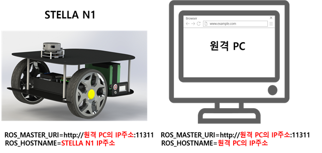
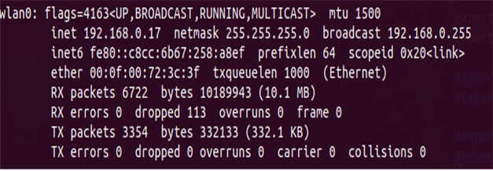
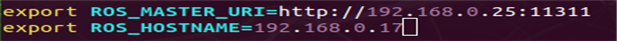

# ROS 1 - JetsonNano(Single Board Computer) 설정

2023년 9월 1일 이후로는 Jetson Nano 버전에 대한 기술 지원이 제한적이오니 이 점 양해 부탁 드립니다. 별도로 제공되는 IMG 파일을 활용해 주시기 바랍니다.

* [ ] &#x20;Single Board Computer 모델 확인하기

<!---->

* STELLA N1 – Jetson Nano 버전에는 NVIDIA Jetson Nano SBC가 기본적으로 구성되어 있습니다. 해당 SBC도 원격 컴퓨터와 동일하게 ROS 및 STELLA 라이브러리 설정이 필요합니다.
* STELLA N1 – Jetson Nano 구매 시, 제공하는 NVIDIA Jetson Nano를 사용하실 경우 기본적으로 하기와 같은 과정이 전부 <mark style="color:red;">**작업된**</mark> <mark style="color:red;">**Ubuntu 18.04 LTS가 탑재된 SD 카드가 제공됩니다.**</mark>
* SD카드를 삽입하여 사용하시면 됩니다. &#x20;
* <mark style="color:blue;">**제공된 SD카드 또는 하기의 링크 .img 형식 이미지 파일을 사용하시는 경우 하기의 네트워크 설정만 진행하시면 됩니다.**</mark>
* OS 재 설치가 필요하신 경우 하기의 링크 .img 형식 이미지 파일을 설치하여 주시기 바랍니다.
* 하기 주소에서 stella\_ubuntu\_18.04.img 파일 다운 받으시면 됩니다.



[http://naver.me/5oibQBnf](http://naver.me/5oibQBnf)



* 기본 탑재된 Ubuntu 18.04 LTS의 초기비밀번호는 1 입니다.
* 저희가 제공하는 IMG 파일이 아닌 사용자께서 직접 설치를 하실 경우 하기의 과정을 참고하여 설치합니다.

<!---->

* [ ] Ubuntu 18.04 LTS 설치

<!---->

* STELLA 내 Jetson Nano에 Ubuntu 18.04를 설치합니다. 설치 방법은 하기의 링크를 참고하여 설치합니다.



[https://developer.nvidia.com/embedded/learn/get-started-jetson-nano-devkit#intro	](https://developer.nvidia.com/embedded/learn/get-started-jetson-nano-devkit#intro)



* [ ] Ubuntu 18.04 설치 후 하기의 명령어를 통해 최신 버전으로 업데이트합니다.

```
sudo apt-get update && sudo apt-get upgrade
```

* [ ] Ubuntu 18.04 LTS 내 ROS 설치

<!---->

* 다음 명령어를 이용하여 Ubuntu 18.04 내 ROS를 설치합니다. 다음 방법을 이용할 경우 STELLA N1 라이브러리 설치부터 이어서 진행합니다.

```
wget https://raw.githubusercontent.com/ntrexlab/ROS_INSTALL_SCRIPT/main/install_ros_melodic.sh&& chmod 755 ./install_ros_melodic.sh && bash ./install_ros_melodic.sh
```

* [ ] STELLA N1 패키지 설치

<!---->

* STELLA N1 관련 패키지 설치합니다.

```
sudo apt-get install ros-melodic-tf
```

* [ ] STELLA N1 라이브러리 설치

<!---->

* STELLA N1 라이브러리 다운로드 및 컴파일을 진행합니다.

```
cd ~/catkin_ws/src
git clone https://github.com/ntrexlab/STELLA_JETSON_NANO.git
cd ~/catkin_ws/src/STELLA_JETSON_NANO/stella_teleop_bluetooth/src/
chmod +x stella_teleop_bluetooth.py
```

* [ ] 패키지 컴파일

<!---->

* <mark style="color:purple;">**새로 터미널  실행  후**</mark> 패키지 컴파일을 진행합니다.

```
cd ~/catkin_ws/
catkin_make
```

* [ ] Serial 통신 설치

<!---->

* 센서 데이터 수집 및 모터드라이버 Command 입출력을 위한 Serial 통신 설정합니다.
* 하기의 명령어를 입력하여 USB 포트 설정합니다.

```
cd ~/catkin_ws/src/STELLA_JETSON_NANO/stella_bringup
sh create_udev_rules.sh
ls -la /dev/ 
```

* Device 목록에 YDLIDAR, AHRS, MW, BT 항목이 생성됨을 확인합니다.

<!---->

* [ ] Jetson Nano 네트워크 설정하기



* 터미널에 ifconfig를 입력하여 Jetson Nano의 네트워크 IP 주소를 확인합니다.



* IP 주소 확인 후, \~/.bashrc 파일을 수정하여 아래와 같이 ROS\_MASTER와 ROS\_HOSTNAME을 확인된 Jetson Nano의 IP로 설정합니다.

```
sudo vim ~/.bashrc  # 마지막 줄에 아래 코드 추가
    export ROS_MASTER_URI=http://[원격 PC의 ip주소]:11311
    export ROS_HOSTNAME=[Jetson Nano의 ip주소]
```



* source 명령어를 터미널에 입력하여 \~/.bashrc 파일 업데이트합니다.

```
source ~/.bashrc
```

* [ ] NTP(Network Time Protocol) 서버를 이용한 시간 설정

```
sudo apt-get install ntpdate
sudo ntpdate ntp.ubuntu.com
```

* [ ] <mark style="color:blue;">**SSH를 이용하여 원격 접속 확인**</mark>

```
(원격 PC에서)$ ssh ntrex@[Jetson Nano의 ip주소]
```

