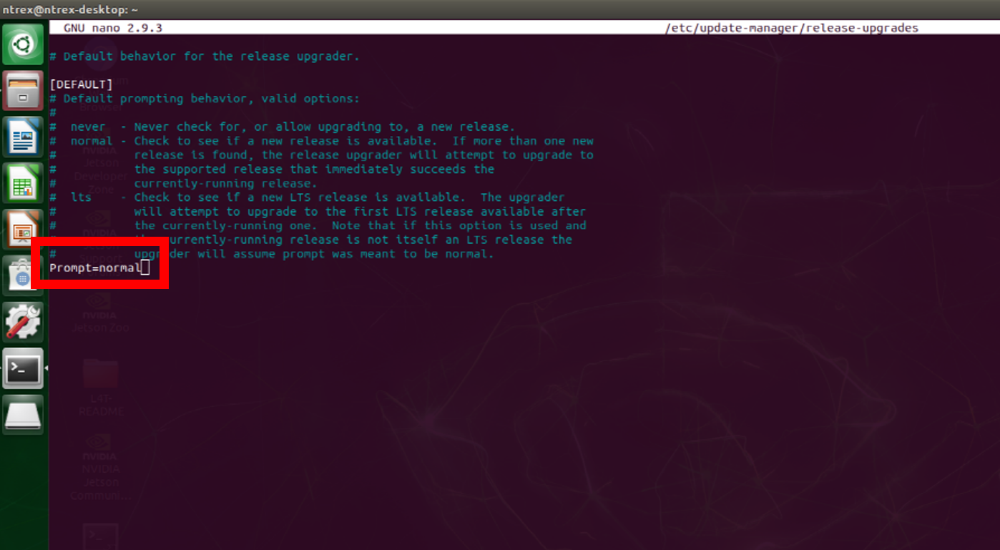
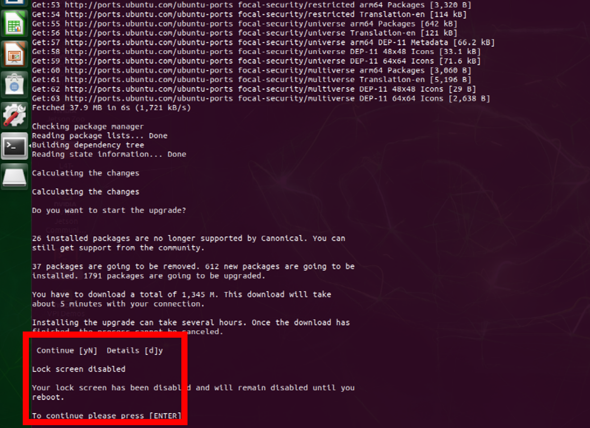
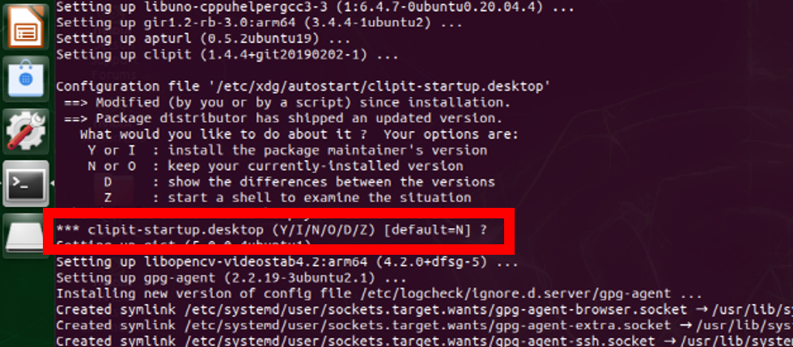
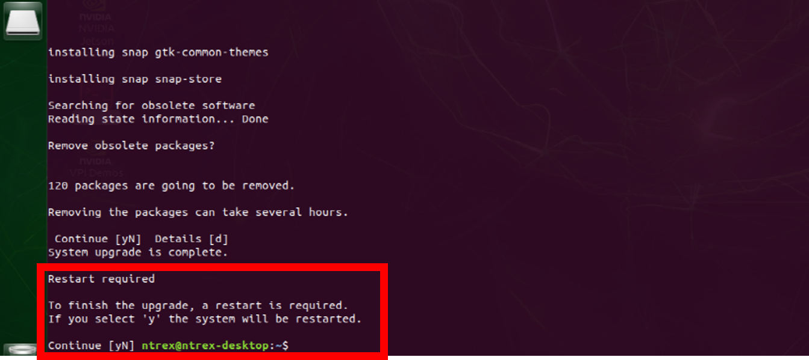
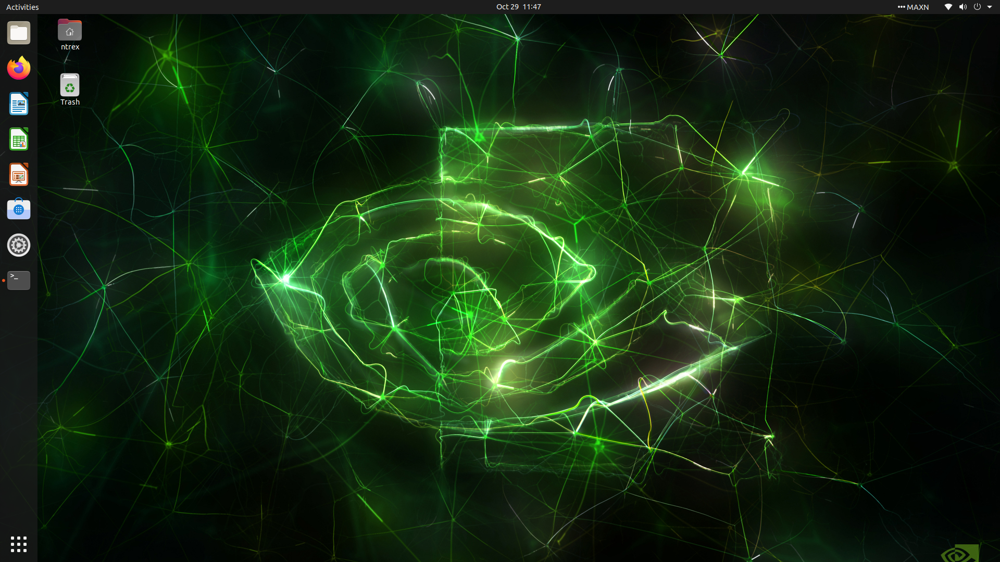

# ROS 2 - JetsonNano(Single Board Computer) 설정

* [ ] Single Board Computer 모델 확인하기


* STELLA N1 – Jetson Nano 버전에는 기본적으로  <mark style="color:red;">**Ubuntu 18.04 LTS(ROS1)가 탑재된 SD 카드가 제공됩니다.**</mark>&#x20;
* ROS 2가 필요하신 경우 하기의 링크에서 <mark style="color:red;">**.img 형식 이미지 파일을 설치합니다.**</mark>&#x20;
* 기본 탑재된 Ubuntu 20.04 LTS의 초기 비밀번호는 1 입니다.  &#x20;
* &#x20;<mark style="color:blue;">**하기의 링크 .img 형식 이미지 파일을 사용하시는 경우 SSH를 이용하여 원격 접속 확인만 진행하시면 됩니다.**</mark>&#x20;



[http://gofile.me/4Z3Cs/N0cZJ5KIm](http://gofile.me/4Z3Cs/N0cZJ5KIm)



* 저희가 제공하는 .img 형식 이미지 파일이 아닌 사용자께서 직접 설치를 하실 경우 하기의 과정을 참고하여 설치합니다.

<!---->

* [ ] Ubuntu 18.04 LTS 설치

<!---->

* STELLA 내 Jetson Nano에 Ubuntu 18.04를 설치합니다. 설치 방법은 하기의 링크를 참고하여 설치합니다.



[https://developer.nvidia.com/embedded/learn/get-started-jetson-nano-devkit#intro	](https://developer.nvidia.com/embedded/learn/get-started-jetson-nano-devkit#intro)



* [ ] &#x20;OS 업그레이드 때, chromium-browser가 오류를 발생 시킬 수 있으므로 제거해줍니다.

```
sudo apt-get remove --purge chromium-browser chromium-browser-l10n
```

* [ ] Ubuntu 18.04 설치 후 하기의 명령어를 통해 최신 버전으로 업데이트합니다.

```
sudo apt update && sudo apt upgrade
```

* [ ] 파일 편집을 위해 nano 설치   &#x20;

```
sudo apt install nano
```

* [ ] 불필요한 패키지 제거  &#x20;

```
sudo apt autoremove
```

* [ ] Ubuntu 20.04 LTS로 업그레이드

<!---->

* Ubuntu 업그레이드를 위하여, OS update를 허용하여 줍니다.

```
sudo nano /etc/update-manager/release-upgrades
    > 맨 밑의 never를 normal로 수정
```



* 현재 시스템 패키지를 모두 업데이트하고 재시작해줍니다.

```
sudo apt update
sudo apt dist-upgrade
sudo reboot
```

* &#x20;OS 업그레이드를 진행하여 줍니다.&#x20;
* <mark style="color:red;">**업그레이드 진행 시 입력이 필요한 경우가 있습니다. 제안 된 기본 값을 사용하여 입력해주시면됩니다. 마지막 바로 재시작을 묻는 대답에만 N를 하시면 됩니다.**</mark>     &#x20;

```
sudo do-release-upgrade
```







* [ ] 업그레이드  진행 후 파일 설정    &#x20;

<!---->

* 각각 명령어입  &#x20;

```
sudo nano /etc/gdm3/custom.conf
```

```
sudo nano /etc/X11/xorg.conf
```

```
sudo nano /etc/update-manager/release-upgrades
```



* [ ] Ubuntu 20.04 LTS 내 ROS2 설치

<!---->

* 다음 명령어를 이용하여 Ubuntu 20.04 내 ROS2를 설치합니다.

```
wget https://raw.githubusercontent.com/ntrexlab/ROS_INSTALL_SCRIPT/main/install_ros2_foxy.sh&& chmod 755 ./install_ros2_foxy.sh && bash ./install_ros2_foxy.sh
```

* [ ] STELLA N1 패키지 설치

<!---->

* STELLA N1 관련 패키지 설치합니다.

```
sudo apt-get install ros-foxy-tf2 ros-foxy-joint-state-publisher
```

* [ ] STELLA N1 라이브러리 설치

<!---->

* STELLA N1 라이브러리 다운로드 및 컴파일을 진행합니다.

```
cd ~/colcon_ws/src/
git clone https://github.com/ntrexlab/STELLA_JETSON_NANO_ROS2.git
cd ~/colcon_ws/src/STELLA_JETSON_NANO_ROS2/stella_teleop_bluetooth/stella_teleop_bluetooth/
chmod +x stella_teleop_bluetooth.py
```

* [ ] 패키지 컴파일

<!---->

* <mark style="color:purple;">**새로 터미널  실행  후**</mark>  패키지 컴파일을 진행합니다.

```
cd ~/colcon_ws
colcon build --symlink-install
```

* [ ] Serial 통신 설치

<!---->

* 센서 데이터 수집 및 모터드라이버 Command 입출력을 위한 Serial 통신 설정합니다.
* 하기의 명령어를 입력하여 USB 포트 설정합니다.

```
cd ~/colcon_ws/src/STELLA_JETSON_NANO_ROS2/stella_bringup
sh create_udev_rules.sh
ls -la /dev/ 
```

* Device 목록에 YDLIDAR, AHRS, MW, BT 항목이 생성됨을 확인합니다.

<!---->

* [ ] NTP(Network Time Protocol) 서버를 이용한 시간 설정

```
sudo apt-get install ntpdate
sudo ntpdate ntp.ubuntu.com
```

* [ ] SSH를 이용하여 원격 접속 확인

```
(원격 PC에서)$ ssh ntrex@[Jetson Nano의 ip주소]
```

