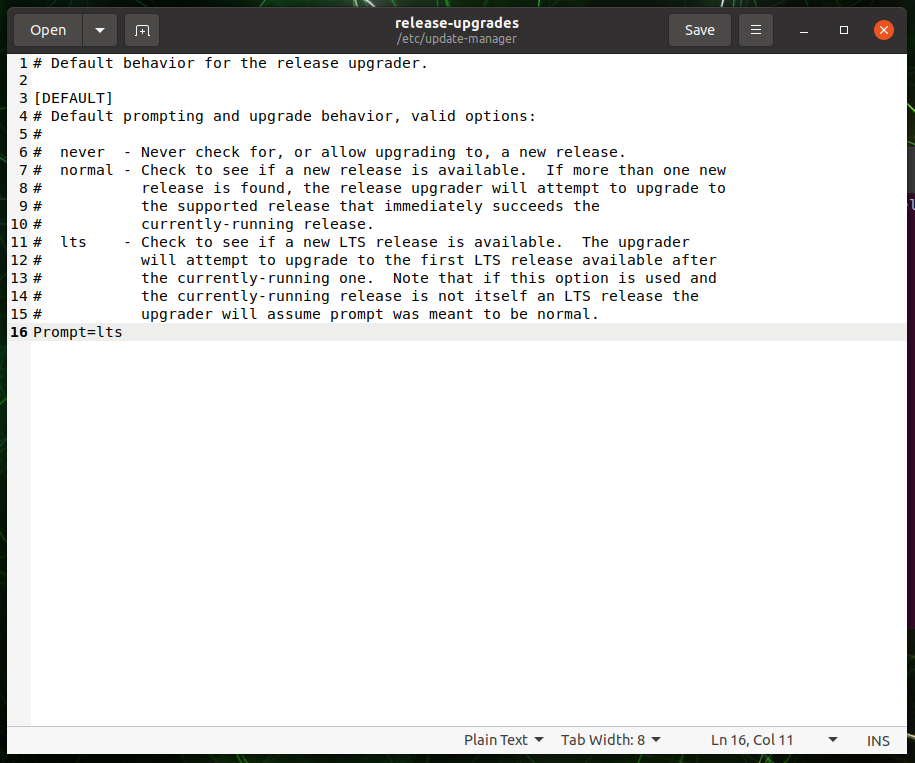

# ROS 2 - JetsonNano(Single Board Computer) 설정

* [ ] Single Board Computer 모델 확인하기
* [ ] STELLA N1 – Jetson Nano 버전에는 NVIDIA Jetson Nano SBC가 기본적으로 구성되어 있습니다. 해당 SBC도 원격 컴퓨터와 동일하게 ROS 2 및 STELLA 라이브러리 설정이 필요합니다.
* [ ] STELLA N1 – Jetson Nano 구매 시, 제공하는 NVIDIA Jetson Nano를 사용하실 경우 기본적으로 하기와 같은 과정이 전부 작업된 Ubuntu 20.04 LTS가 탑재되어 제공됩니다.
* [ ] OS 재설치가 필요하신 경우 하기의 링크에서 IMG파일을 설치하여 주시기 바랍니다.



[http://gofile.me/4Z3Cs/N0cZJ5KIm](http://gofile.me/4Z3Cs/N0cZJ5KIm)



* Jetson Nano에 기본 탑재된 Ubuntu 20.04 LTS의 초기비밀번호는 1 입니다.
* 저희가 제공하는 IMG 파일이 아닌 사용자께서 직접 설치를 하실 경우 하기의 과정을 참고하여 설치합니다.


* [ ] Ubuntu 18.04 LTS 설치
*   [ ] STELLA 내 Jetson Nano에 Ubuntu 18.04를 설치합니다. 설치 방법은 하기의 링크를

    &#x20;참고하여 설치합니다.



[https://developer.nvidia.com/embedded/learn/get-started-jetson-nano-devkit#intro	](https://developer.nvidia.com/embedded/learn/get-started-jetson-nano-devkit#intro)



* [ ] Ubuntu 18.04 설치 후 하기의 명령어를 통해 최신 버전으로 업데이트합니다.

```
sudo apt-get update && sudo apt-get upgrade
```

* [ ] Ubuntu 20.04 LTS로 업그레이드

<!---->

* Ubuntu 업그레이드를 위하여, OS update를 허용하여 줍니다.

```
sudo gedit /etc/update-manager/release-upgrades
    > 맨 밑의 never를 lts로 수정
```



* 현재 시스템 패키지를 모두 업데이트하고 불필요한 패키지를 제거합니다.

```
sudo apt-get update
sudo apt-get upgrade -y
sudo apt autoremove -y
```

* OS 업그레이드를 실행하여줍니다. 이 때, chromium-browser가 오류를 발생시킬 수 있으므로 제거해줍니다.

```
sudo apt-get remove --purge chromium-browser chromium-brower-l10n 
```

* &#x20;OS 업그레이드를 진행하여 줍니다.&#x20;

```
sudo do-release-upgrade -d -f DistUpgradeViewGtk3
```

* 우측 위쪽의 아이콘 오류를 없애기 위해 이미지 파일을 제거해줍니다.

```
sudo rm -r /usr/share/nvpmodel_indicator/
```

* 업그레이드가 끝나면 재 실행해줍니다.&#x20;

```
sudo reboot
```


* [ ] Ubuntu 20.04 LTS 내 ROS2 설치
* [ ] 다음 명령어를 이용하여 Ubuntu 20.04 내 ROS2를 설치합니다.

```
wget https://raw.githubusercontent.com/ntrexlab/ROS_INSTALL_SCRIPT/main/install_ros2_foxy.sh&& chmod 755 ./install_ros2_foxy.sh && bash ./install_ros2_foxy.sh
```

* STELLA N1 패키지 설치
* STELLA N1 관련 패키지 설치합니다.

```
sudo apt-get install ros-foxy-tf2 ros-foxy-joint-state-publisher
```

* [ ] STELLA N1 라이브러리 설치
* [ ] STELLA N1 라이브러리 다운로드 및 컴파일을 진행합니다.

```
cd ~/colcon_ws/src/
git clone https://github.com/ntrexlab/STELLA_JETSON_NANO_ROS2.git
cd ~/colcon_ws/src/STELLA_JETSON_NANO_ROS2/stella_teleop_bluetooth/stella_teleop_bluetooth/
chmod +x stella_teleop_bluetooth.py
```

* [ ] 패키지 컴파일
* [ ] 패키지 컴파일을 진행합니다.

```
cd ~/colcon_ws
colcon build --symlink-install
```

* [ ] Serial 통신 설치
* [ ] 센서 데이터 수집 및 모터드라이버 Command 입출력을 위한 Serial 통신 설정합니다.
* [ ] 하기의 명령어를 입력하여 USB 포트 설정합니다.

```
cd ~/colcon_ws/src/STELLA_JETSON_NANO_ROS2/stella_bringup
sh create_udev_rules.sh
ls -la /dev/ 
```

* Device 목록에 YDLIDAR, AHRS, MW, BT 항목이 생성됨을 확인합니다.

<!---->

* [ ] NTP(Network Time Protocol) 서버를 이용한 시간 설정

```
sudo apt-get install ntpdate
sudo ntpdate ntp.ubuntu.com
```

* [ ] SSH를 이용하여 원격 접속 확인

```
(원격 PC에서)$ ssh ntrex@[Jetson Nano의 ip주소]
```

