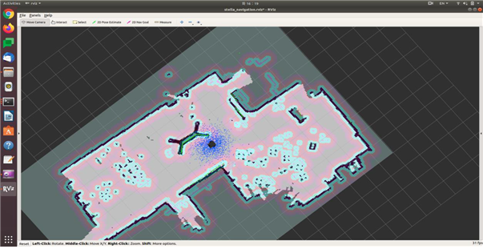

# ROS 1 - STELLA N1 Navigation

* 완성된 지도를 이용하여 지도 내에 원하는 목적지로 주행하는 기능을 사용합니다.

<!---->

* [ ] <mark style="color:red;">**원격PC에서 터미널에서**</mark>  roscore 실행&#x20;

```
roscore
```

* [ ] STELLA N1 구동 파일 실행&#x20;

<!---->

* SSH를 이용하여 STELLA N1 SBC로 원격 접속하여 구동에 필요한 모터드라이버, LIDAR, AHRS 센서를 실행합니다.
* STELLA N1 구동을 시작하는 패키지인 stella\_bringup 내의 stella\_robot.launch 파일을 실행하기 위해서 하기의 명령을 터미널에 입력합니다.
* <mark style="color:red;">**원격PC 새로운 터미널**</mark>에서 SSH로 SBC에 접속합니다.

```
ex) ssh ntrex@192.168.0.xxx 입력 후 패스워드 입력
```

* <mark style="color:red;">**원격PC SSH 접속 터미널**</mark>에서 명령어를 입력합니다. &#x20;

```
roslaunch stella_bringup stella_robot.launch
```


* [ ] STELLA Navigation 실행&#x20;

<!---->

* <mark style="color:red;">**원격PC 새로운 터미널**</mark>에서 stella\_navigation을 실행합니다. 이 때, map\_file의 경로를 지정해주며 /home/ 위치에 $HOME/.yaml로 지정합니다.

```
roslaunch stella_navigation stella_navigation.launch map_file:=$HOME/map.yaml
```



* [ ] Navigation 기능을 이용하여 목적지 이동&#x20;

<!---->

* 저장된 지도와 STELLA N1의 위치가 UI와 같은 rviz 프로그램 창에서 나타납니다.
* Rviz 상단에 위치한 2D Pose Estimate 버튼을 누르고 STELLA의 실제 위치에 놓은 후, 더 정확한 위치 추정을 위해 키보드를 사용하여 주변을 이동하며 localization을 수행합니다.
* 상단에 위치한 2D Nav Goal 버튼을 누르고 목적지를 클릭하여 STELLA N1을 이동시킵니다.

