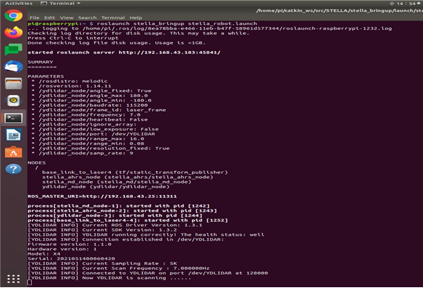
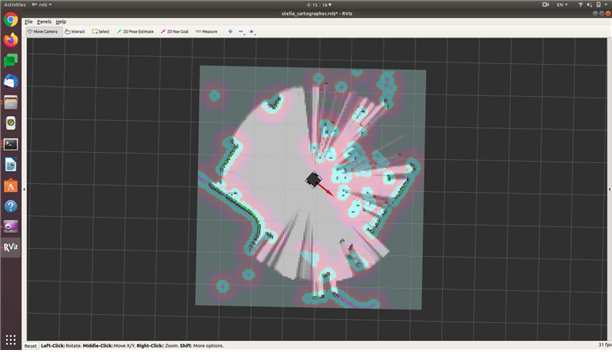

# ROS 1 - STELLA N1 SLAM

*   ROS의 경우 네트워크를 통한 통신을 기반으로 구현되어 있기 때문에 원격 PC 와 SBC가 같은 Wifi 네트워크 망에 연결되어 있으며 인터넷도 정상 작동하는지 확인 후 진행합니다.                        &#x20;


* 자율주행을 하기 위해 필요한 기능 중 하나인 SLAM(Simultaneous localization and mapping) 기능을 이용하고자 합니다. SLAM이란 로봇이 주변을 탐색하여 로봇의 현재 위치 및 지도를 추정할 수 있는 기술입니다. STELLA N1을 이용하여 Cartographer 알고리즘으로 구현된 SLAM 기능을 이용하고자 합니다. SLAM 기능을 사용하기 위해 하기의 과정에 따라 진행합니다.


* [ ] <mark style="color:purple;">**원격PC에서  터미널을 실행  후**</mark>** **<mark style="color:red;">****</mark> roscore 실행&#x20;

```
roscore
```


* [ ] STELLA N1 구동 파일 실행&#x20;

<!---->

* SSH를 이용하여 STELLA N1 SBC로 원격 접속하여 구동에 필요한 모터드라이버, LIDAR, AHRS ROS 드라이버를 실행합니다.
* STELLA N1 구동을 시작하는 패키지인 stella\_bringup 내의 stella\_robot.launch 파일을 실행하기 위해서 하기의 명령을 터미널에 입력합니다.
* <mark style="color:red;">**원격PC 새로운 터미널**</mark>에서 SSH로 SBC에 접속합니다.

```
ex) ssh ntrex@192.168.0.xxx 입력 후 패스워드 입력
```

* <mark style="color:red;">**위 빨간 글씨  SSH 접속 터미널**</mark>에서 명령어를 입력합니다.   &#x20;

```
roslaunch stella_bringup stella_robot.launch
```



* [ ] SLAM 노드 실행

<!---->

* <mark style="color:green;">**원격PC에서 에 새로운 터미널**</mark>에서 하기의 명령어를 입력합니다.&#x20;

```
roslaunch stella_slam stella_slam.launch
```



* [ ] 키보드 조작을 통해 주행과 함께 주변 환경 매핑(mapping)

<!---->

* <mark style="color:orange;">**원격PC에서 새로운 터미널**</mark>에서 하기의 명령어를 입력합니다.

```
roslaunch stella_teleop stella_teleop_key.launch
```


* [ ] 완성된 지도 저장&#x20;

<!---->

* Map\_Server를 이용하여 지도를 저장합니다. 저장된 지도는 /home// 경로에 map.pgm, map.yaml로 저장됩니다.
* <mark style="color:blue;">**SLAM 노드를 종료하지 않은 상태로 원격PC 새로운 터미널**</mark>에서 하기의 명령어를 입력합니다.

```
rosrun map_server map_saver -f ~/map
```

