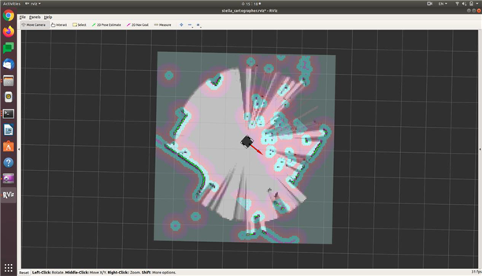

# ROS 2 - STELLA N1 SLAM

* 자율주행을 하기 위해 필요한 기능 중 하나인 SLAM\(Simultaneous localization and mapping\) 기능을 이용하고자 합니다. SLAM이란 로봇이 주변을 탐색하여 로봇의 현재 위치 및 지도를 추정할 수 있는 기술입니다. STELLA N1을 이용하여 Cartographer 알고리즘으로 구현된 SLAM 기능을 이용하고자 합니다. SLAM 기능을 사용하기 위해 하기의 과정에 따라 진행합니다.


* [ ] roscore 실행 

```text
roscore
```


* [ ] STELLA N1 구동 파일 실행 
* SSH를 이용하여 STELLA N1 SBC로 원격 접속하여 하기의 명령어를 실행합니다.

```text
(SSH 접속 후) roslaunch stella_bringup stella_robot.launch
```


* [ ] SLAM 노드 실행

```text
roslaunch stella_slam stella_slam.launch
```



* [ ] 키보드 조작을 통해 주행과 함께 주변 환경 매핑\(mapping\)

```text
roslaunch stella_teleop stella_teleop_key.launch
```


* [ ] 완성된 지도 저장 
* Map\_Server를 이용하여 지도를 저장합니다. 저장된 지도는 /home// 경로에 map.pgm, map.yaml로 저장됩니다.

```text
rosrun map_server map_saver -f ~/map
```


