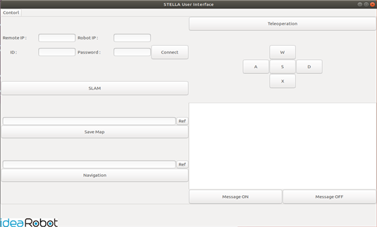
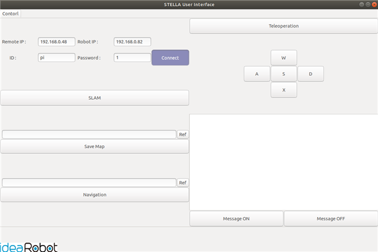
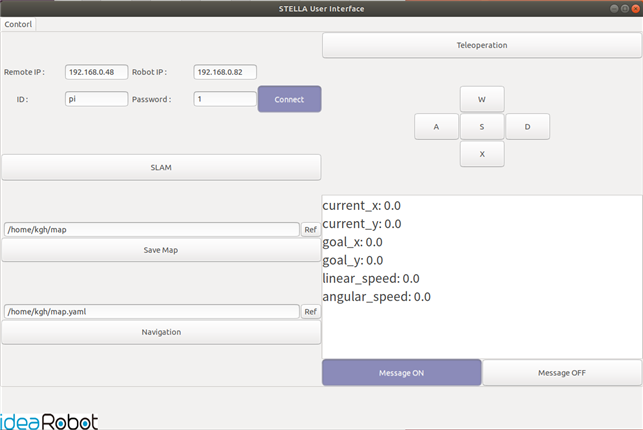
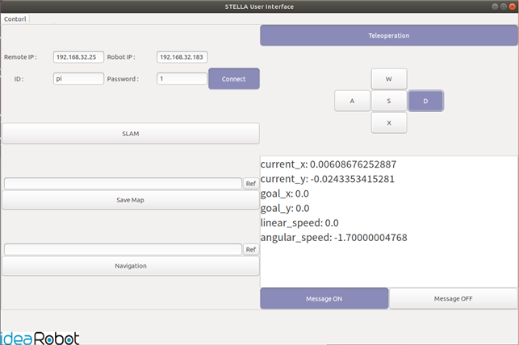

# ROS 2 - STELLA N1 UI 이용 구동

* STELLA N1에서는 UI를 이용하여 Raspberry Pi 또는 Jetson Nano 임베디드 장치와의 통신을 통해 위에서 기술된 STELLA 구동 및 SLAM, Navigation, Teleoperation 기능을 이용할 수 있습니다.


* [ ] UI 설치 
* STELLA\_UI를 설치하기에 앞서, STELLA\_UI를 실행하는데 필요한 의존성을 먼저 설치합니다.

```text
 sudo apt-get install python-pip
 pip install psutil
 sudo apt-get install sshpasss
```

* STELLA\_UI 라이브러리를 다운로드 후, 컴파일을 진행합니다.

```text
cd ~/catkin_ws/src/
git clone https://github.com/ntrexlab/STELLA_UI.git
cd ~/catkin_ws/src/STELLA_UI/scripts/
chmod +x stella_ui_dialog.pyc
cd ~/catkin_ws/
catkin_make
```


* [ ] STELLA UI 실행 
* 하기의 명령어를 통해 STELLA\_UI를 실행합니다.

```text
roslaunch stella_ui stella_ui.launch
```



* [ ] STELLA UI 실행 – SBC 연결 
* STELLA\_UI 기능들을 이용하기 위해서는 일단 Remote PC와 STELLA N1의 임베디드 장치가 연결되어 있어야 합니다. 
* 하기의 그림에 표시되어 있는 부분을 통하여, Remote PC와 Robot\(STELLA N1\)의 IP, Robot의 ID와 패스워드를 입력한 후, Connect 버튼을 클릭합니다.
* STELLA N1의 YDLIDAR가 동작하면, 연결 및 세팅에 성공한 것입니다.
* 연결에 성공했을 경우에만 UI 내의 다른 기능을 이용할 수 있습니다.
* UI 사용 종료 시에는 connect 버튼을 다시 눌러 로봇의 동작을 멈추어야 합니다.



* [ ] STELLA UI 실행 – Message 
* Message 기능을 이용하여 로봇의 상태 정보를 받아볼 수 있습니다.
* Message ON 버튼을 클릭하여 로봇의 상태 정보를 수신할 수 있고, Message OFF 버튼을 

  클릭하여 로봇의 상태 정보 수신을 일시 정지 할 수 있습니다.

* Message 기능을 이용하여 수신할 수 있는 로봇의 상태 정보는 rviz 상에서의 로봇의 좌표,  rviz 상에서의 로봇의 목표 좌표, 로봇의 현재 선속도 및 각속도 입니다.
* 밑에 그림의 Message 창에서 보이는 current\_x, current\_y가 로봇의 현재좌표, goal\_x, goal\_y는 로봇의 목표 좌표를 나타내고, linear\_speed 및 angular\_speed는 각각 로봇의 현재 선속도 및 각속도를 나타냅니다.



* [ ] STELLA UI 실행 – Teleoperation 
* Teleoperation 기능을 이용하여, STELLA N1을 조종할 수 있습니다.
* Teleoperation 버튼을 누른 후, UI 상의 W, A, S, D, X 버튼을 클릭하거나 키보드의 W, A, S, D, X을 이용하여 로봇을 조종할 수 있습니다.
* Message 창을 이용하여 현재 로봇의 속도를 확인할 수 있습니다.
* Teleopeartion 버튼을 다시 눌러, Teleoperation 기능을 비활성화 할 수 있습니다.





