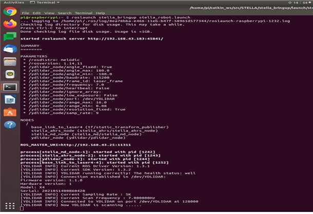
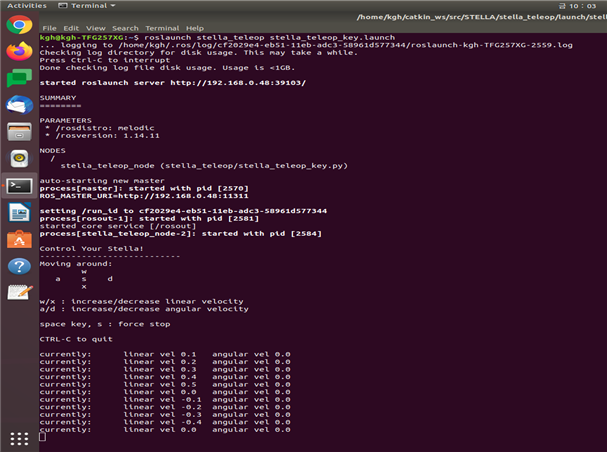

# ROS 1 - STELLA N1 구동

* [ ] roscore 실행

<!---->

* 원격 PC에서 터미널 실행 후 roscore 실행합니다.

```
roscore
```

* [ ] STELLA N1 구동 파일 실행&#x20;

<!---->

* SSH를 이용하여 STELLA N1 SBC로 원격 접속하여 구동에 필요한 모터드라이버, LIDAR, AHRS 센서를 실행합니다.
* STELLA N1 구동을 시작하는 패키지인 stella\_bringup 내의 stella\_robot.launch 파일을 실행하기 위해서 하기의 명령을 터미널에 입력합니다.
* 새로운 터미널에서 SHSSH&#x20;

```
ex) ssh odroid@192.168.0.xxx 입력 후 패스워드 입력
```

* <mark style="color:red;">**SSH 접속 터미널**</mark>에서 명령어를 입력합니다. &#x20;

```
roslaunch stella_bringup stella_robot.launch
```



* [ ] 키보드를 이용하여 원격 구동 실행
* [ ] 구동 준비 완료 확인을 위해 Teleoperation 기능을 이용하여 키보드 조작을 통해 STELLA N1 구동테스트 수행합니다.

```
roslaunch stella_teleop stella_teleop_key.launch
```



