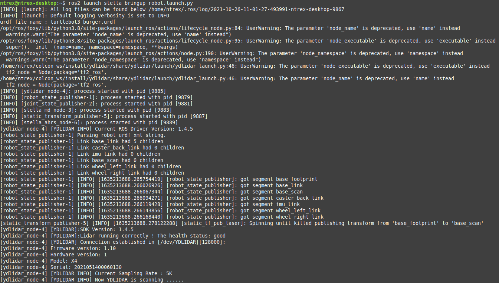
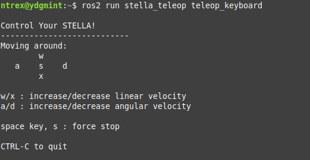

# ROS 2 - STELLA N1 구동

* [ ] STELLA N1 구동 파일 실행&#x20;
* [ ] SSH를 이용하여 STELLA N1 SBC로 원격 접속하여 구동에 필요한 모터드라이버, LIDAR, AHRS 센서를 실행합니다.
* [ ] STELLA N1 구동을 시작하는 패키지인 stella\_bringup 내의 robot.launch.py 파일을 실행하기 위해서 하기의 명령을 터미널에 입력합니다.

```
$ (SSH 접속 후) ros2 launch stella_bringup robot.launch.py
```



* [ ] 키보드를 이용하여 원격 구동 실행
* [ ] 구동 준비 완료 확인을 위해 Teleoperation 기능을 이용하여 키보드 조작을 통해 STELLA N1 구동테스트 수행합니다.

```
ros2 run stella_teleop teleop_keyboard
```



