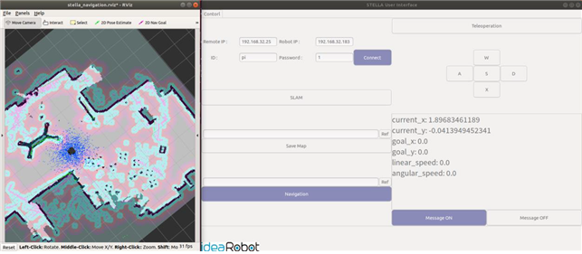

# STELLA UI 실행 - Navigation

* UI 상의 Navigation 버튼을 이용하여 Navigation 기능을 이용할 수 있습니다.
* UI 상의 Navigation 버튼 위의 경로 지정창을 이용하여 map file의 경로를 지정해주어 Navigation 버튼을 클릭하면, 하기의 그림과 같이 RVIZ창이 열리며 Navigation 기능이 실행됩니다.
* Rviz 상단에 위치한 2D Pose Estimate 버튼을 누르고 STELLA의 실제 위치에 놓은 후, 더 정확한 위치 추정을 위해 Teleoperation 기능을 사용하여 주변을 이동하며 localization을 수행합니다.
* 상단에 위치한 2D Nav Goal 버튼을 누르고 목적지를 클릭하여, STELLA N1을 이동시킵니다. 이 때, Teleoperation 기능이 비활성화 되어있어야 정상적으로 Navigation 기능을 이용할 수 있습니다.
* Navigation 버튼을 다시 클릭하여 Navigation 기능을 종료할 수 있습니다.

