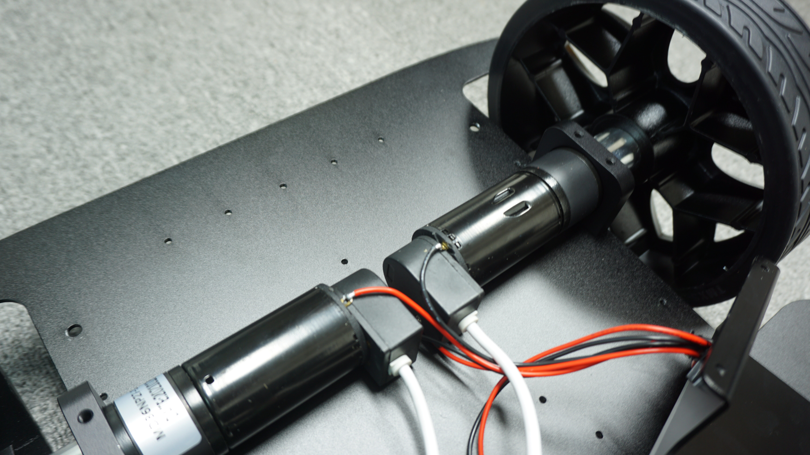
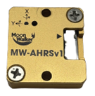
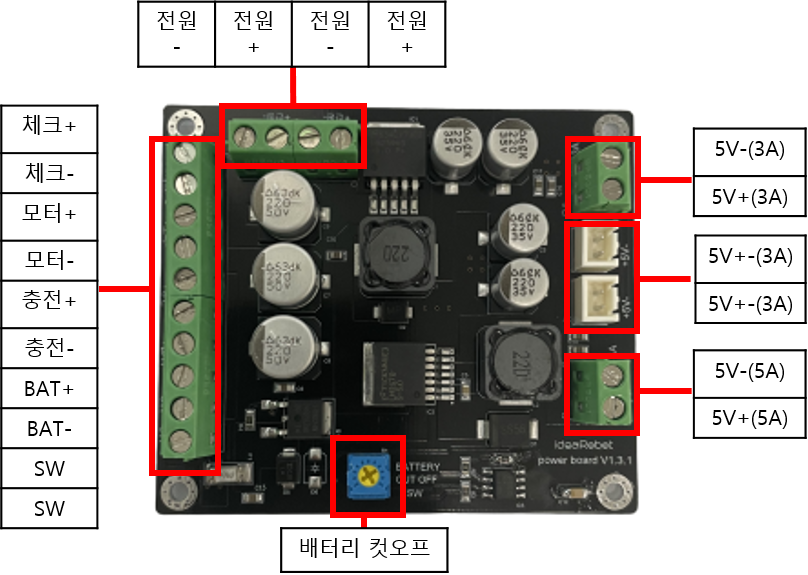
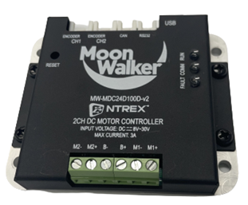
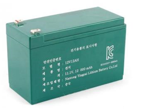
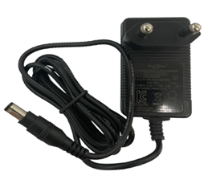
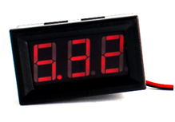
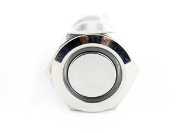

# 중요 부품

* [ ] DC MOTOR

|   |   |
| :---: | :---: |
| 구동 전압\(V\) | 12 |
| 감속 속도 \(RPM\) | 325±30 |
| 정격 속도\(RPM\) | 230±20 |
| 정격 회전력\(kg.cm\) | 13.5 |
| 무부하 전류\(A\) | 0.3 |
| 정격 전류\(A\) | 2.3 |
| 회전자 구속전류\(A\) | 7 |

* [ ] MW-AHRSv1

* 두께 1.6mm의 알루미늄 케이스
* 칼만 필터를 이용한 가속도와 자이로 센서 융합
* 0° 유지 에러: &lt; 0.1°
* Dynamic Error: &lt; 2°
* Euler angle’s Resolution: 0.001°
* Response Time: &lt; 1ms
* 크기\(L, W, H\): 29.6mm, 31.4mm, 10mm
* 인터페이스 : RS232 / CAN
* 가속도, 각속도, 각도, 자기, 온도 데이터 출력

* [ ] STELLA N1 전원보드

* [ ]  MW-MDC24D100D-v2 모터드라이버

* Unipolar/Bipolar PWM 스위칭 방법 설정 및 18kHz에서 40kHz까지 PWM 주파수 설정
* CAN, USB\(Virtual Serial Port\), RS-232 연결 지원 \(CAN 통신 속도: 10K ~ 1M bps, RS-232/USB 통신 속도: 9600 ~ 921600bps\)
* Incremental Encoder 피드백으로 정밀한 위치 제어 및 속도 제어
* PWM ratio의 직접 출력으로 개회로\(Open loop\) 속도 설정
* 배터리 전압 측정으로 제어기의 과전압, 저전압 보호 기능
* 모터의 전류 측정으로 모터의 과전류 보호 기능
* FET 방열판의 온도 측정으로 제어기 과열 보호 기능
* 모터 특성 설정에 따른 출력 제한 \(정격 전압 제한, 최고 전류 제한, 최고 속도 제한\)
* 3개의 LED를 사용한 Fault 표시, 동작 상태 표시, 통신 상태 표시

* [ ] 배터리 관련 부
* 12V 12Ah 리튬 이온 배터리

|   |   |
| :---: | :---: |
| 정 격 | 11.1V, 12000mAh |
| 제품 사이즈 | 150\*65\*96mm |

* [ ] 12V 12Ah 리튬 충전기

|   |   |
| :---: | :---: |
| 정격 입격 | 100-240V\(50/60Hz\) 0.6A\(Max\) |
| 정격 출격 | 12.6V / 1.0A |

* [ ] 전압 표시

|   |   |
| :---: | :---: |
| 전압 표 | 4.5V ~ 36V |
| 제품 사이즈 | 48\*29\*18mm |

* [ ] LED 메탈 푸쉬락 스위치 링\(파랑 12V\)

|   |   |
| :---: | :---: |
| 정격 전류 | 5A |
| 정격 전압  | 250 VAC |

