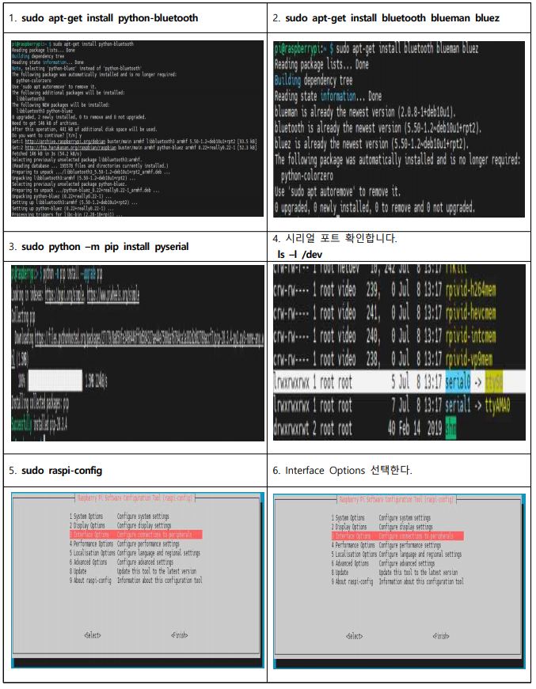
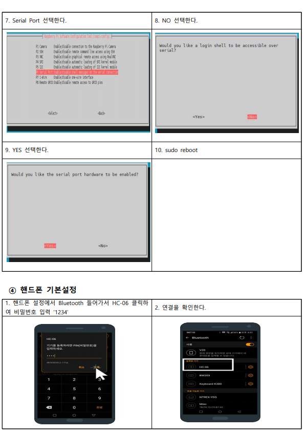

# App 이용하여 STELLA N1 구동

* STELLA N1에 HC-06 통신 모듈을 이용하여 Raspberry Pi 또는 Jetson Nano 임베디드 장치에서 App와 Bluetooth 무선 통신을 하여 STELLA N1을 조작 할 수 있습니다.


* [ ] App 설치 
* 모바일 환경에서 Github 주소 이동.



[https://github.com/ntrexlab/App\_Install/blob/main/app-release.apk](https://github.com/ntrexlab/App_Install/blob/main/app-release.apk)




* [ ] Bluetooth modul \(HC-06\) 연결
* Raspberry Pi 4


* Jetson Nano


* [ ] 싱글보드 Bluetooth 설정 \(Jetson Nano는 1~4까지만 진행\)
* sudo apt-get update && sudo apt-get upgrade 진행 후 설치해야 합니다.
* 이미지 클릭 시 확대가 가능하여 크게 보실 수 있습니다.





* [ ] 실행 
* ros bluetooth 실행 코드를 입력합니다.

```text
roslaunch stella_teleop_bluetooth stella_teleop_bluetooth.launch
```

* motordriver 실행 코드를 입력합니다.

```text
roslaunch stella_md stella_mwdriver.launch
```

* 그 후 App를 이용하여 조작하시면 됩니다.


