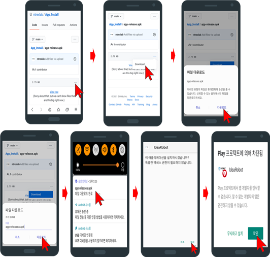
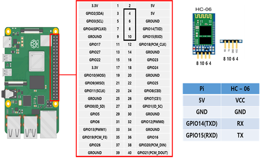
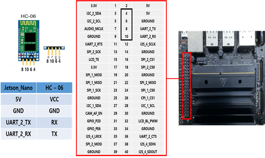

# App 이용하여 STELLA N1 구동

* STELLA N1에 HC-06 통신 모듈을 이용하여 Raspberry Pi 또는 Jetson Nano 임베디드 장치에서 App와 Bluetooth 무선 통신을 하여 STELLA N1을 조작 할 수 있습니다.


* [ ] App 설치 
* 모바일 환경에서 Github 주소 이동.



[https://github.com/ntrexlab/App\_Install/blob/main/app-release.apk](https://github.com/ntrexlab/App_Install/blob/main/app-release.apk)





* [ ] Bluetooth modul \(HC-06\) 연결
* Raspberry Pi 4



* Jetson Nano



* [ ] 싱글보드 Bluetooth 설정 \(Jetson Nano는 밑에 명령어 4개까지만 진행 하시면 됩니다.\)

```text
sudo apt-get update && sudo apt-get upgrade
```

* sudo apt-get update && sudo apt-get upgrade 진행 후 설치해야 합니다.

```text
sudo apt-get install python-bluetooth
```

```text
sudo apt-get install bluetooth blueman bluez
```

```text
sudo python –m pip install pyserial
```

* [ ] Raspberry Pi 만 추가 진행  

```text
sudo raspi-config
    ->  Interface Options 선택.
    ->  Serial Port 선택.
    ->  No 선택.
    ->  Yes 선택.
sudo reboot
```

* [ ] 핸드폰 기본 설정 
* 핸드폰 설정에서 Bluetooth 들어가서 HC-06 클릭하여 비밀번호 입력 ‘1234‘ or '0000'


* 연결을 확인한다. 


* [ ] 실행 
* ros bluetooth 실행 코드를 입력합니다.


```text
roslaunch stella_teleop_bluetooth stella_teleop_bluetooth.launch
```

* motordriver 실행 코드를 입력합니다.

```text
roslaunch stella_md stella_mwdriver.launch
```

* 그 후 App를 이용하여 조작하시면 됩니다. 


