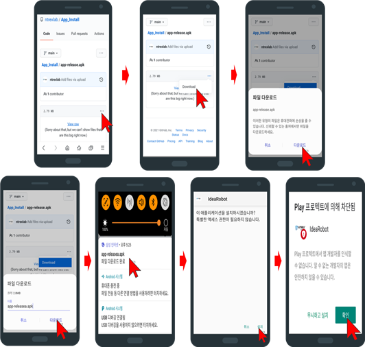
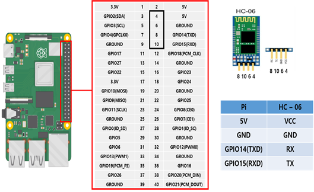
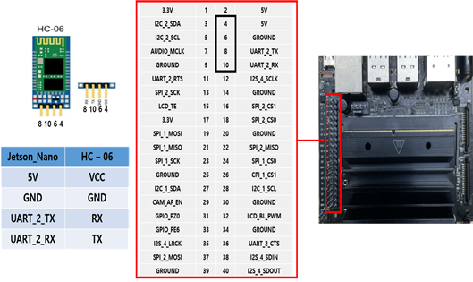
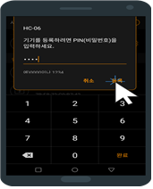
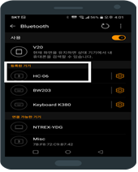

# ROS 2 - App 이용하여 STELLA N1 구동

* ROS 경우 <mark style="color:red;">**네트워크를 통한 통신을**</mark> 기반으로 구현되어 있기 때문에 <mark style="color:red;">**원격 PC 와 SBC가 동일 Wifi 네트워크 망에 연결 되어 있으며 인터넷도 정상 작동하는지 확인 후 진행합니다.**</mark>    &#x20;


* STELLA N1에 HC-06 통신 모듈을 이용하여 Raspberry Pi 또는 Jetson Nano 임베디드 장치에서 App와 Bluetooth 무선 통신을 하여 STELLA N1을 조작 할 수 있습니다.

<!---->

* [ ] App 설치&#x20;

<!---->

* 모바일 환경에서 Github 주소 이동.



[https://github.com/ntrexlab/App\_Install/blob/main/app-release.apk](https://github.com/ntrexlab/App\_Install/blob/main/app-release.apk)





* [ ] Bluetooth modul (HC-06) 연결

<!---->

* Raspberry Pi 4



* Jetson Nano



* [ ] Raspberry Pi 만 추가 진행 &#x20;

```
sudo raspi-config
    ->  Interface Options 선택.
    ->  Serial Port 선택.
    ->  No 선택.
    ->  Yes 선택.
sudo reboot
```

* [ ] 핸드폰 기본 설정&#x20;

<!---->

* 핸드폰 설정에서 Bluetooth 들어가서 HC-06 클릭하여 비밀번호 입력 ‘1234‘ or '0000'



* 연결을 확인한다.&#x20;




* [ ] 실행&#x20;


* <mark style="color:red;">**원격PC 새로운 터미널**</mark>에서 SSH로 SBC에 접속합니다.

```
ex) ssh ntrex@192.168.0.xxx 입력 후 패스워드 입력
```

* <mark style="color:red;">**위 빨간 글 SSH 접속 터미널에서**</mark>  ros bluetooth 실행 코드를 입력합니다.

```
ros2 launch stella_teleop_bluetooth stella_teleop_bluetooth.launch.py
```

* <mark style="color:green;">**원격PC 새로운 터미널**</mark>에서 SSH로 SBC에 접속합니다.

```
ex) ssh ntrex@192.168.0.xxx 입력 후 패스워드 입력
```

* <mark style="color:green;">**위 초록 글 SSH 접속 터미널에서**</mark>** **<mark style="color:red;">****</mark> motordriver  실행 코드를 입력합니다.

```
ros2 launch stella_md stella_md_launch.py
```

* 그 후 App를 이용하여 조작하시면 됩니다.&#x20;

