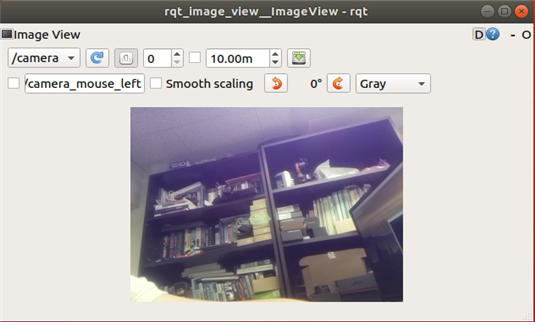

# STELLA N1 Pi Camera Module V2 설치 및 구동하기

* [ ] Pi Camera Module V2 연결  


* [ ] 싱글보드 Bluetooth 설정 \(Raspberry Pi 버전만 실행\)
* sudo apt-get update && sudo apt-get upgrade


* [ ] 실행 
* camera 패키지를 실행하기 위한 기본 설정을 진행합니다. 

       -  SBC가 Raspberry Pi 인 경우 

```text
(SSH 접속 후) cd ~/catkin_ws/src/STELLA_RASPBERRYPI/stella_camera/src/
chmod +x stella_camera.py
```

       - SBC가 Jetson Nano인 경우 

```text
 (SSH 접속 후) cd ~/catkin_ws/src/STELLA_JETSON_NANO/stella_camera/src/
 chmod +x stella_camera.py
```


* camera 패키지를 실행합니다.

```text
(SSH 접속 후) roslaunch stella_camera stella_camera.launch
roscore
rqt_image_vies /camera
```



* [ ] UI 이용 camera 실행 
* camera 기능이 추가된 UI를 다운로드 후, 컴파일을 진행합니다.

```text
cd ~/catkin_ws/src/
git clone https://github.com/ntrexlab/STELLA_UI_CAMERA.git
cd ~/catkin_ws/src/STELLA_UI_CAMERA/scripts/
chmod +x stella_ui_dialog.pyc
cd ~/catkin_ws/
catkin_make
```

