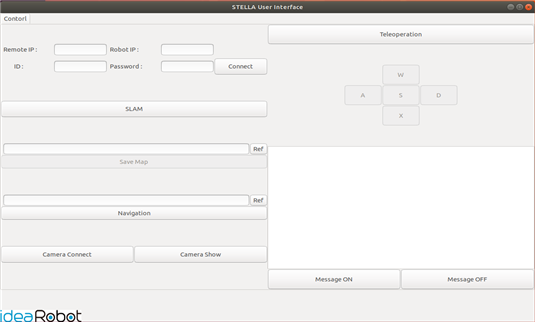
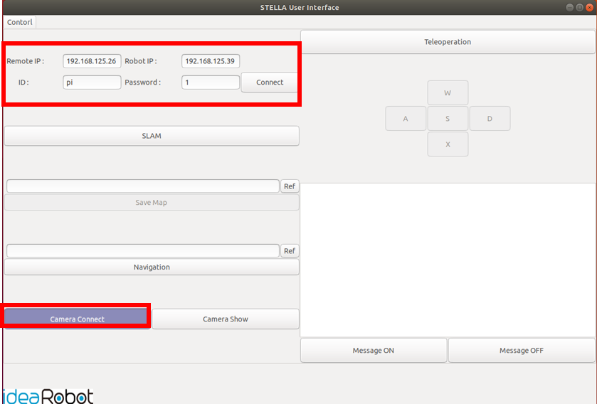
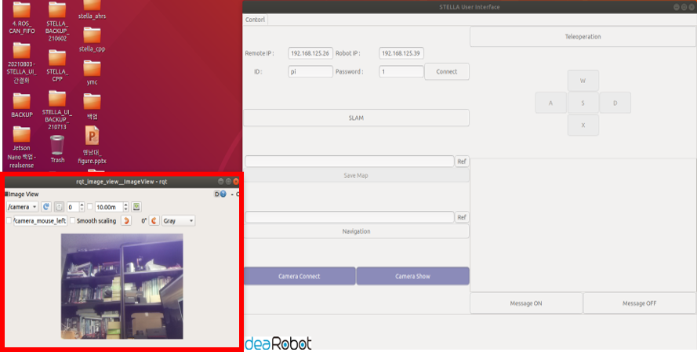

# ROS 1 - STELLA N1 Pi Camera Module V2 설치 및 구동하기

* [ ] Pi Camera Module V2 연결


* [ ] 싱글보드 Bluetooth 설정 (Raspberry Pi 버전만 실행)

<!---->

* sudo apt-get update && sudo apt-get upgrade


* [ ] 실행&#x20;

<!---->

* camera 패키지를 실행하기 위한 기본 설정을 진행합니다.&#x20;
* <mark style="color:red;">**원격PC 새로운 터미널**</mark>에서 SSH로 SBC에 접속합니다.

```
ex) ssh ntrex@192.168.0.xxx 입력 후 패스워드 입력
```

1. &#x20;SBC가 Raspberry Pi 인 경우&#x20;

* <mark style="color:red;">**원격PC SSH 접속 터미널**</mark>에서 명령어를 입력합니다. &#x20;

```
cd ~/catkin_ws/src/STELLA_RASPBERRYPI/stella_camera/src/
chmod +x stella_camera.py
```

2\.   SBC가 Jetson Nano인 경우&#x20;

```
 cd ~/catkin_ws/src/STELLA_JETSON_NANO/stella_camera/src/
 chmod +x stella_camera.py
```

* [ ] 실행

<!---->

* <mark style="color:red;">**원격 PC에서 터미널**</mark> 실행 후 roscore 실행합니다.

```
roscore
```

* [ ] STELLA N1 구동 파일 실행&#x20;

<!---->

* <mark style="color:red;">**원격PC 새로운 터미널**</mark>에서 SSH로 SBC에 접속합니다.

```
ex) ssh ntrex@192.168.0.xxx 입력 후 패스워드 입력
```

* <mark style="color:red;">**원격PC SSH 접속 터미널**</mark>에서 명령어를 입력합니다. &#x20;

```
roslaunch stella_bringup stella_robot.lau
```

* <mark style="color:red;">**원격PC 새로운 터미널에서**</mark> camera 패키지를 실행합니다.

```
rqt_image_view /camera
```


* [ ] UI 이용 camera 실행&#x20;
*
[ ]   *
* [ ] camera 기능이 추가된 UI를 다운로드 후, 컴파일을 진행합니다.

```
cd ~/catkin_ws/src/
git clone https://github.com/ntrexlab/STELLA_UI_CAMERA.git
cd ~/catkin_ws/src/STELLA_UI_CAMERA/scripts/
chmod +x stella_ui_dialog.pyc
cd ~/catkin_ws/
catkin_make
```

* 하기의 명령어를 통해 STELLA\_UI\_CAMERA를 실행합니다.&#x20;

```
roslaunch stella_ui_camera stella_ui_camera.launch
```



*   기의 그림에 표시되어 있는 부분을 통하여, Remote PC와 Robot(STELLA N1)의 IP,

    &#x20;Robot의 ID와 패스워드를 입력한 후, Camera Connect 버튼을 클릭합니다.&#x20;



* 충분한 시간이 흐른 후 Camera Show 버튼을 클릭하면, 카메라 영상을 받아보실 수 있습니다.


