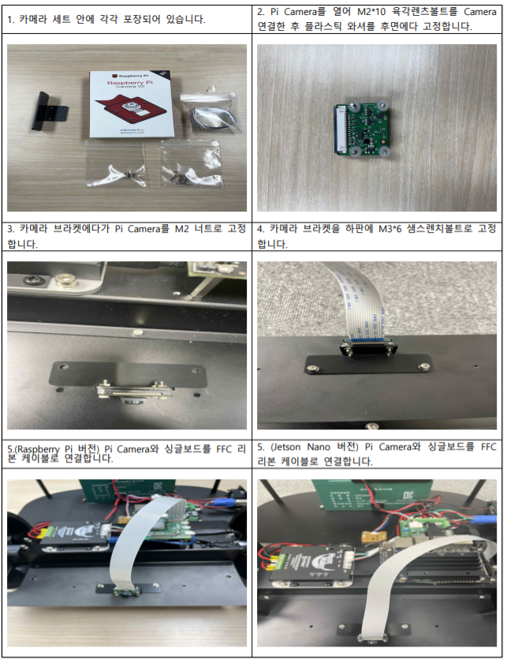
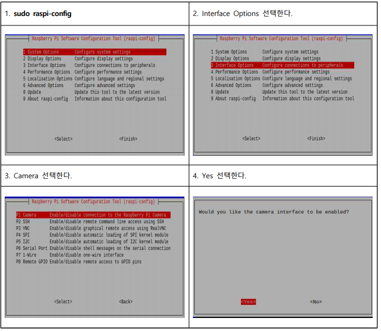

# ROS 2 - STELLA N1 Pi Camera Module V2 설치 및 구동하기

* [ ] Pi Camera Module V2 연결



* [ ] 싱글보드 Bluetooth 설정 (Raspberry Pi 버전만 실행)
* [ ] sudo apt-get update && sudo apt-get upgrade



* [ ] 실행&#x20;
* [ ] camera 패키지를 실행하기 위한 기본 설정을 진행합니다.&#x20;

&#x20;      \-  SBC가 Raspberry Pi 인 경우&#x20;

```
(SSH 접속 후) cd ~/colcon_ws/src/STELLA_RASPBERRYPI_ROS2/stella_camera/stella_camera/
chmod +x stella_camera.py
```

&#x20;      \- SBC가 Jetson Nano인 경우&#x20;

```
(SSH 접속 후) cd ~/colcon_ws/src/STELLA_JETSON_NANO_ROS2/stella_camera/stella_camera/
chmod +x stella_camera.py
```


* camera 패키지를 실행합니다.

```
(SSH 접속 후) ros2 launch stella_camera stella_camera.launch.py
ros2 run rqt_image_view rqt_image_view /camera
```

.png>)

* [ ] UI 이용 camera 실행&#x20;
* [ ] camera 기능이 추가된 UI를 다운로드 후, 컴파일을 진행합니다.

```
cd ~/colcon_ws/src/
git clone https://github.com/ntrexlab/STELLA_UI_CAMERA_ROS2.git
cd ~/colcon_ws/src/STELLA_UI_CAMERA_ROS2/stella_ui_camera/stella_ui_camera/
chmod +x stella_ui_dialog.py
cd ~/colcon_ws/
colcon build --symlink-install
```

* 하기의 명령어를 통해 STELLA\_UI\_CAMERA를 실행합니다.&#x20;

```
ros2 launch stella_ui_camera stella_ui_camera.launch
```


*   기의 그림에 표시되어 있는 부분을 통하여, Remote PC와 Robot(STELLA N1)의 IP,

    &#x20;Robot의 ID와 패스워드를 입력한 후, Camera Connect 버튼을 클릭합니다.&#x20;


* 충분한 시간이 흐른 후 Camera Show 버튼을 클릭하면, 카메라 영상을 받아보실 수 있습니다.


