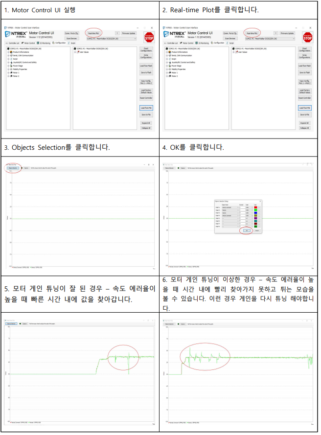
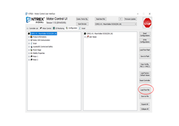
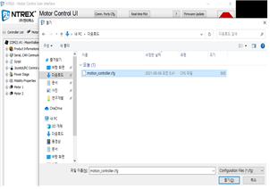
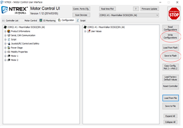

# 모터 게인 확인 및 수정

* 자사 제품 모터드라이버는 GUI를 이용하여 간단하게 모터를 튜닝 할 수 있습니다. STELLA N1에 무게를 추가하거나 모터가 추정치에 늦게 반응 시 게인 값을 변경해야 합니다.

* 당사의 모터 드라이버 프로그램 다운로드



[https://www.devicemart.co.kr/goods/view?no=1077424\#goods\_file](https://www.devicemart.co.kr/goods/view?no=1077424#goods_file)



* [ ] 튜닝 방법



[https://github.com/ntrexlab/MOTOR\_GAIN.git](https://github.com/ntrexlab/MOTOR_GAIN.git)



* UI를 켜서 Load from File을 클릭합니다.

* 다운로드 받은 프로파일 셋업 파일을 클릭 후 열기를 클릭합니다.

* Write Configurations를 클릭 후 Save to Fla sh 클릭합니다.

