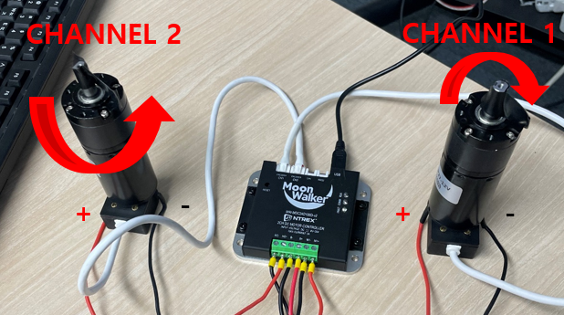
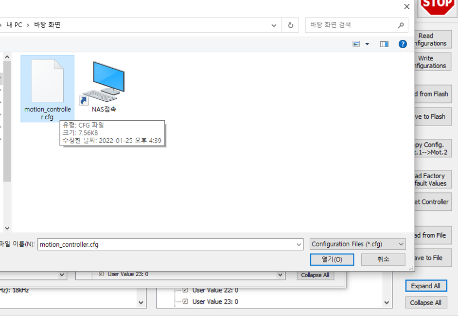
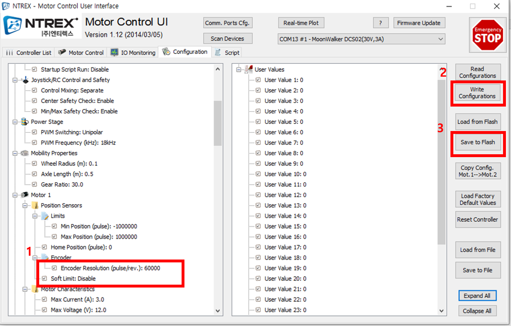

# 모터드라이버 환경설정

* [ ] STELLA 구동 시 Motor 센서 값 이상한 경우 윈도우 환경에서 UI를 통해 설정 값을 확인하셔야 됩니다.

* [ ] Mobile\_Ui 다운로드  설치합니다. &#x20;



[https://www.devicemart.co.kr/goods/view?no=1077424#goods\_file](https://www.devicemart.co.kr/goods/view?no=1077424#goods\_file)



* [ ] 모터와 모터 드라이버 배선도&#x20;

* [ ] 환경 설정 확인 방법&#x20;

<!---->

* 모터드라이버를 USB를 통해 PC에 연결합니다.
* Mobile\_UI를 실행 후 Scan Devices 버튼을 클릭합니다.

* Configuration(1) 버튼을 클릭 후 Expand All(2) 버튼을 클릭합니다.

* Motor 1,2 Encoder 값을 확인한다. Stella N1 540000, Stella N2 60000 이면 정상 파라미터.

* 이 후 모터 컨트톨러 페이지에서 Velocity 양수 입력시 모터에 + 선이 왼쪽에 있다고 가정 시 Channel 1은 시계 방향, Channel 2은 반시계 방향으로 작동 시 정상 5,6번 정상일 경우 .

* 모터드라이버 환경이 위와 다른경우 하기 메뉴얼을 진행해주시면 됩니다.    &#x20;

<!---->

* [ ] 모터 파라메타 설정 파일 적용 .&#x20;

<!---->

* Stella 프로파일 셋업 파일 다운로드 합니다.



[https://github.com/ntrexlab/MOTOR\_GAIN](https://github.com/ntrexlab/MOTOR\_GAIN)



* Mobile\_UI를 실행 후 Scan Devices 버튼을 클릭합니다.

* Configuration(1) 버튼을 클릭 후 Load From File(2) 버튼을 클릭합니다.

* 위에서 다운로드 한 파일 선택합니다.

* Motor 1,2 Encoder(1) 값을 확인한다. Stella N1 540000, Stella N2 60000 이면 정상 파라미터 Write Configurations(2) 클릭 후 Save to Flash(3) 클릭합니다.

&#x20;  &#x20;
